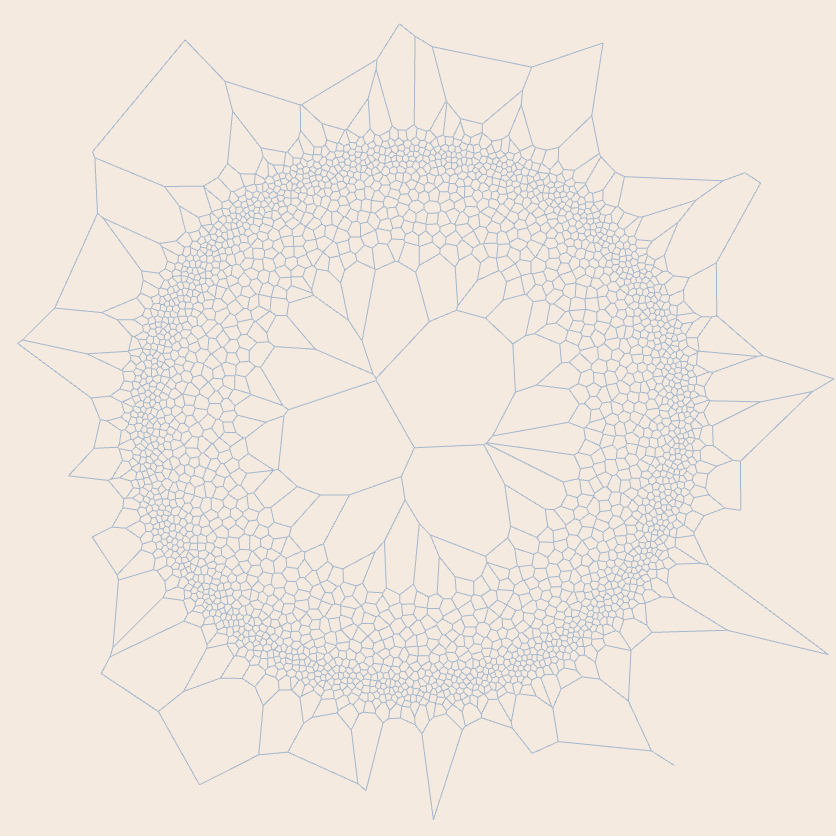
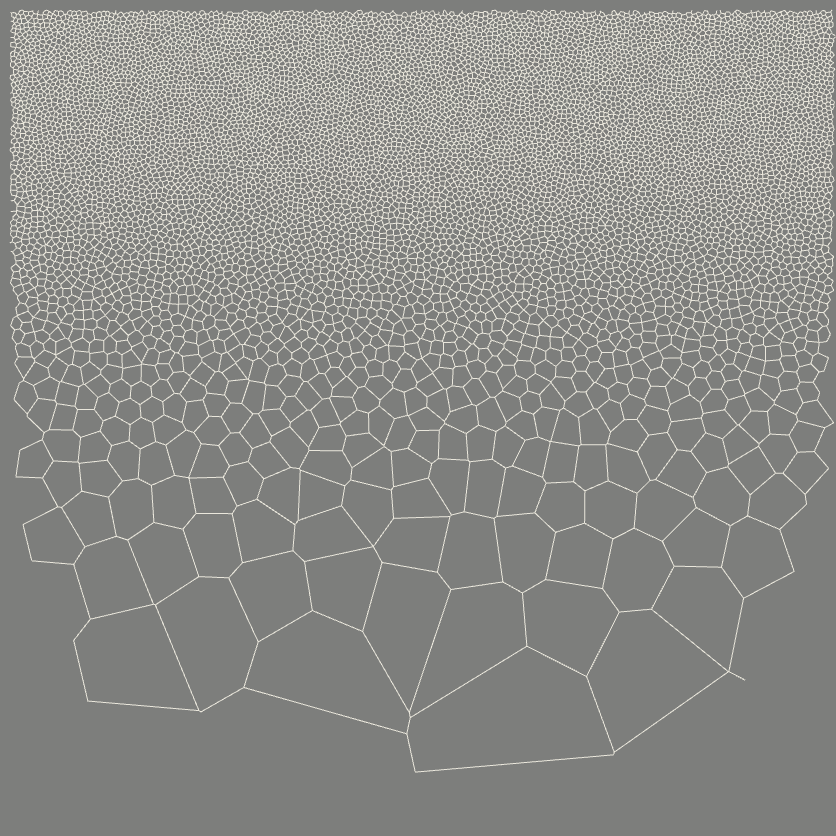
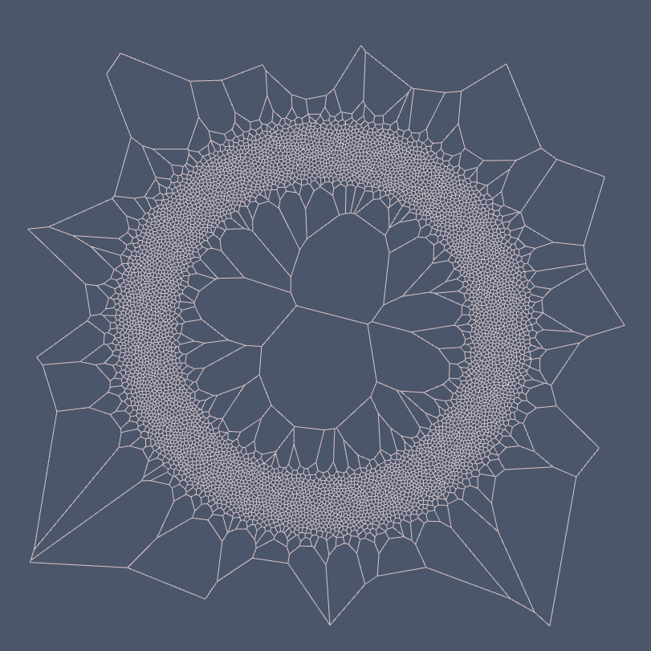
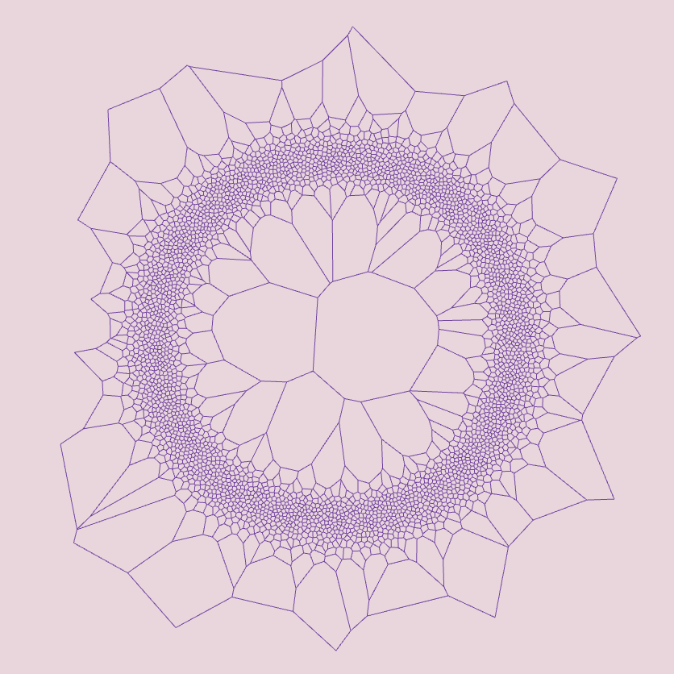
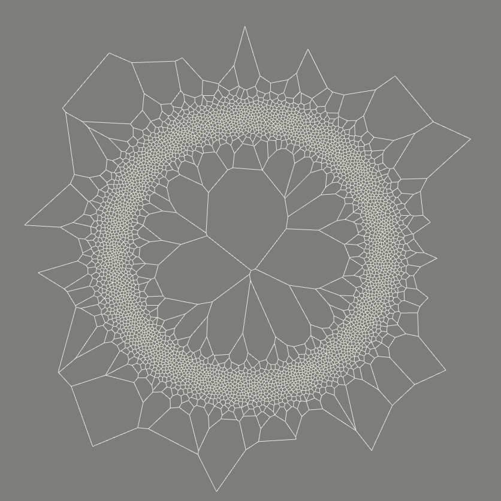
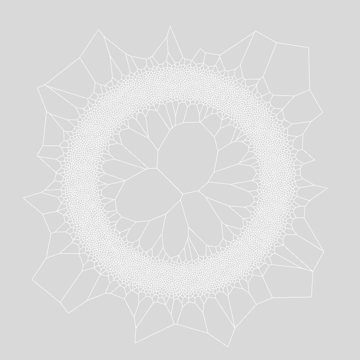

# _*Recursive Scatter*_

A generative art project that scatters points in a 2D space using Poisson Disk sampling and uses a Voronoi graph to connect them. The scattering density is driven by an image displacement map.

**To run the project in a local server:**

```sh
npm i && npm run dev
```

**Each render of the `<canvas />` will produce a random iteration:**








**To build the project to `/dist`:**

```sh
npm run build
```
